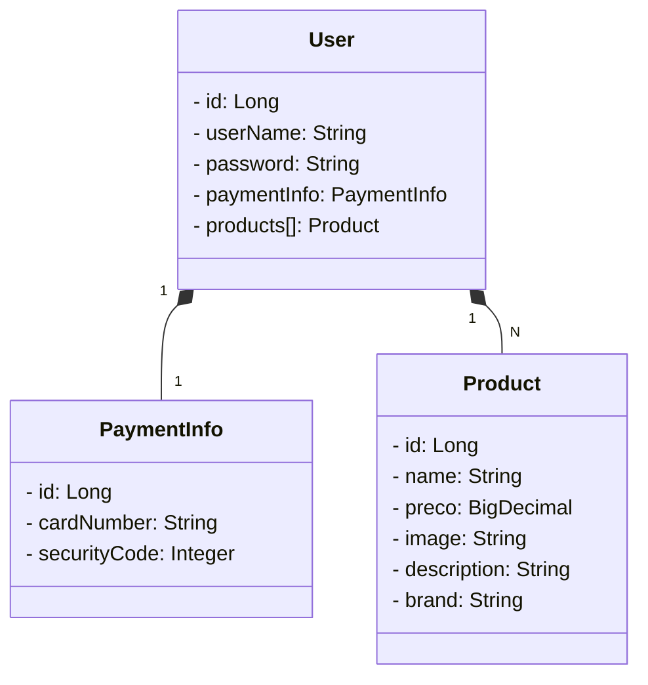

# DioSantander_Padaria
Java RESTFul API criada para o bootcamp Dio/Santander

## Diagrama de Classes

```mermaid
classDiagram
  class User {
    - id: Long
    - userName: String
    - password: String
    - paymentInfo: PaymentInfo
    - products[]: Product
  }

  class PaymentInfo {
    - id: Long
    - cardNumber: String
    - securityCode: Integer
  }

  class Product {
    - id: Long
    - name: String
    - preco: BigDecimal
    - image: String
    - description: String
    - brand: String
  }

  User "1" *-- "1" PaymentInfo
  User "1" *-- "N" Product
```
## Observações:

DTO's serão implementadas no futuro